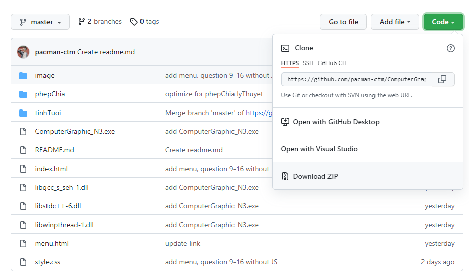
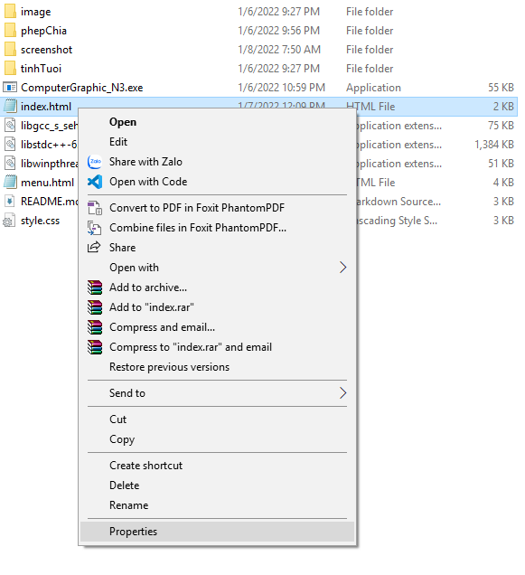
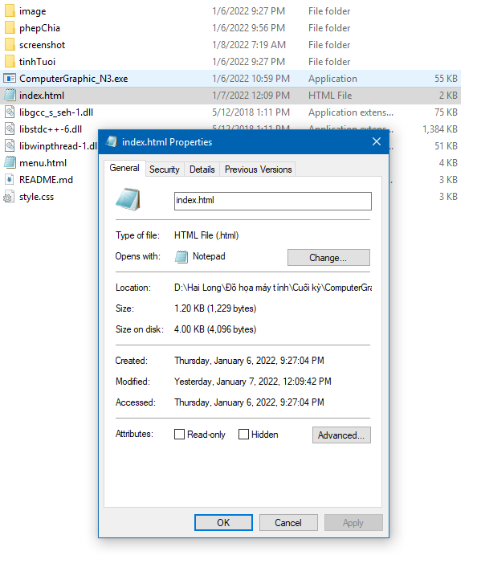
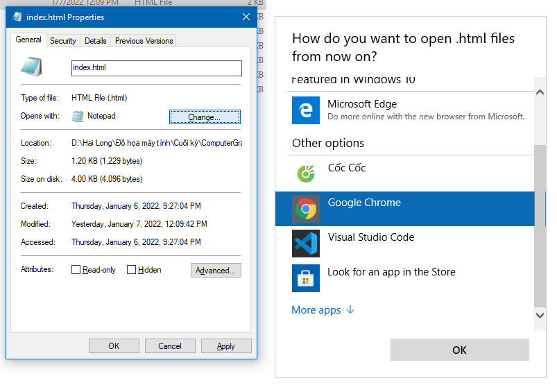

# ComputerGraphic_N3

Đây là bài tập lớn cuối kỳ của nhóm 3 môn Đồ hoạ máy tính INT3401 1 (Học kỳ 1 năm học 2021-2022) tại trường Đại học Công nghệ - Đại học Quốc gia Hà Nội.

## Đề bài: Tạo một ứng dụng đồ hoạ học toán cho học sinh tiểu học (cụ thể ở đây nhóm đảm nhận phần Phép chia và Tính tuổi)

## Hướng dẫn sử dụng:
- Chọn ô `code` (màu xanh lá cây, chọn `Download Zip`) 
- Giải nén tệp tin tải về
- Mở file `ComputerGraphic_N3.exe`, ứng dụng sẽ tự động mở trên trình duyệt web mặc định (ví dụ: Google chrome, Cốc Cốc, Internet Explorer) của người dùng
- Trong trường hợp không có hoặc không mở được file `ComputerGraphic_N3.exe`, chuột phải vào file `index`, chọn `Properties` ở dòng cuối cùng 
- Sẽ hiện ra cửa sổ sau 
- Chọn `change` và sau đó chọn phần mềm trình duyệt web bất kỳ (ví dụ: Google chrome, Cốc Cốc, Internet Explorer)
- Sau đó, ta có thể click vào file `index` là có thể mở được ứng dụng trên trình duyệt web
- Mỗi chương sẽ có phần Lý thuyết (dùng để minh hoạ bài toán) và Thực hành (gồm các quiz để tự luyện)

## Triển khai

Nhóm triển khai bài toán dưới dạng một ứng dụng web, với phần đồ hoạ ở phần minh hoạ các Lý thuyết. Trong đó:
 + Sử dụng **Processing cho JavaScript** [**(p5.js)**](https://p5js.org) để mô phỏng phép chia đồng thời sử dụng HTML, CSS để tạo bố cục cho trang web. Các tính năng chính gồm:
 1. 6 button tự động đổi màu và các ô chứa viên kẹo tự động đổ màu nền khi di chuột vào.
 2. Khi ấn vào ô viên kẹo, ô đó sẽ giữ cố định màu nền.
 3. Có hiển thị trường hợp chia cho 0.
 4. Phương pháp xử lý thay đổi hình ảnh: xóa đi, render lại. Do processing nếu cài đặt mặc định sẽ tự cập nhật frame liên tục, rất tốn hiệu năng, nên phải tắt hết loop đi, chỉ render lại frame khi có event.
 + Sử dụng [**Two.js**](https://two.js.org) để mô phỏng bài toán Tính tuổi. Cụ thể: 
 1. Các thanh biểu diễn tuổi được two.js render thành svg. 
 2. Sử dụng input range để thay đổi độ dài các thanh theo độ tuổi. Hai thanh thể hiện sự cố định của khoảng cách tuổi và sự thay đổi về tỉ lệ giữa tuổi của phụ huynh và con cái. Thanh thể hiện tuổi phụ huynh được chia thành các phần với số chia là tuổi của con.

Ngoài ra, nhóm sử dụng HTML, CSS, Javascript và framework Bootstrap để tạo giao diện cho các bài quiz ở mỗi phần Thực hành. Học sinh có thể xem giải thích ở phần giải thích, hoặc làm bài ở phần trả lời câu hỏi, khi trả lời đúng/sai sẽ hiện ra thông báo tương ứng với kết quả. 

